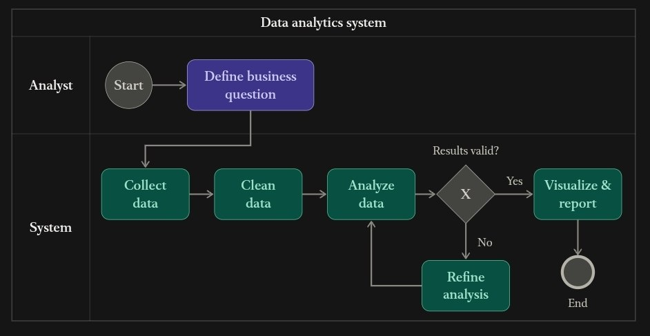
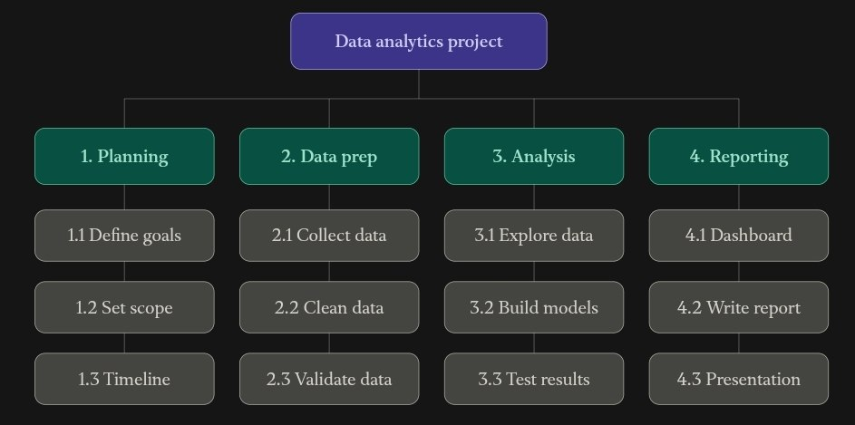

# IT Project Management

University coursework by **Lolo_Team**, covering project planning, system analysis, and an **E-Commerce Sales Analysis** project.

This repository brings together the project plan, process diagrams, work breakdown structures, scheduling examples, and a requirements-analysis presentation.

## Team

| Member | Student ID | Group | Role |
| --- | --- | --- | --- |
| Abdulloh Xojimurodov | 202490365 | I24A | Team Leader |
| Najmiddin Kurganov | 202490180 | I24A | Project Planner |
| Biloliddin To'laganov | 202490326 | I24A | Project Speaker |

## Main Project: E-Commerce Sales Analysis

The project plans to use Python and Pandas to examine online sales data and answer business questions about products, customers, markets, and sales trends.

### Objectives

- Analyze overall sales performance and monthly sales trends.
- Identify best-selling products and products generating the most revenue.
- Compare sales across countries.
- Identify the most valuable customers.
- Calculate average order value.
- Present findings and recommendations supported by the analysis.

### Planned Workflow

1. **Select the dataset:** choose an appropriate e-commerce sales dataset from Kaggle and document its source and fields.
2. **Prepare the data:** handle missing values, remove duplicate records, correct data types, and calculate revenue where appropriate.
3. **Analyze sales:** filter records, group sales by product, country, and customer, and create monthly summaries and pivot tables.
4. **Present results:** create charts, interpret the findings, and prepare the final report and presentation.

The exact dataset and its size remain unspecified in the project plan. The repository currently contains documentation and visual materials; the dataset, analysis code, and final analytical results have not yet been included.

## Repository Materials

| Material | Description |
| --- | --- |
| [Project Plan 01](Project%20Plan%2001) | Team information, sales-analysis objectives, planned workflow, and timeline |
| [TTMIK Requirements Analysis](TTMIK_Requirements_Analysis_Visual.pptx) | Eight-slide presentation analyzing the TTMIK YouTube channel as a Korean-learning resource |
| [E-Commerce Order Process](photo_5321456345535945573_y.jpg) | Process diagram covering browsing, checkout, stock checks, payment, and delivery |
| [E-Commerce Use Case Diagram](photo_5321456345535945574_y.jpg) | Customer, administrator, payment gateway, and delivery-service interactions |
| [E-Commerce Work Breakdown Structure](photo_5321456345535945582_y.jpg) | Example task breakdown for a simple order-management system |
| [E-Commerce Gantt Chart](photo_5321456345535945583_y.jpg) | Example schedule for the order-management system |
| [E-Commerce Interface Mockup](photo_5321456345535945584_y.jpg) | Illustrative storefront, cart, checkout, and administrator dashboard |
| [Data Analytics Process](photo_5323364973167713652_y.jpg) | Workflow from defining a business question to validating and reporting results |
| [Data Analytics Work Breakdown Structure](photo_5323364973167713748_y.jpg) | Planning, data preparation, analysis, and reporting tasks |

The order-management diagrams and interface mockup are supporting design examples. They do not represent a deployed application. Their schedule is separate from the sales-analysis project timeline below.

## Sales Analysis Timeline

| Period | Planned Activities |
| --- | --- |
| September 7–13 | Dataset search and project planning |
| September 14–20 | Data cleaning and preparation |
| September 21–27 | Data analysis and visualization |
| September 28–October 4 | Results interpretation and report preparation |
| October 5–13 | Final report and presentation preparation |
| October 14 | Project presentation |

These dates reflect the planned schedule, rather than confirmed completion status.

## Visual Overview

### Data Analytics Process



### Work Breakdown Structure



## TTMIK Requirements Analysis

The presentation examines **Talk To Me In Korean's YouTube channel** from a System Analysis and Design perspective. It covers learner groups, the learner journey, functional and non-functional requirements, strengths, limitations, and proposed improvements.

It distinguishes YouTube-channel features from TTMIK's separate course services and labels the proposed learning-companion interface as an illustrative concept.

## Viewing the Materials

Browse the plan and images directly on GitHub. Download the `.pptx` file and open it in PowerPoint or another compatible presentation application to view the slides and speaking notes.

To obtain a local copy:

```bash
git clone https://github.com/AbdullohXX/IT-Project-Management.git
cd IT-Project-Management
```

No application installation or execution is required to view the current materials.
